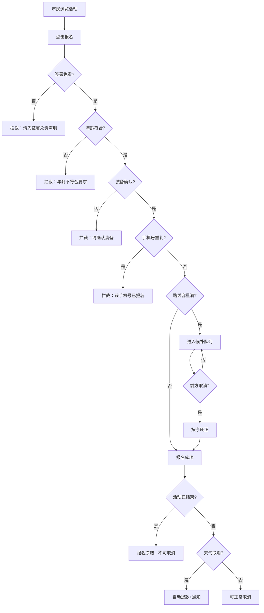

## 1. 产品概述

城市绿道活动报名系统——面向组织者、市民、志愿者三方角色的全流程活动运营平台。覆盖从活动发布、报名审核、现场签到到活动复盘的完整生命周期，内置路线容量管控、候补转正、天气风险预警、免责签署拦截等多层校验机制。

- 解决问题：传统绿道活动报名仅收集姓名，缺乏风险管控与运营闭环，导致超员、未签免责、装备不符等问题频发
- 目标用户：城市绿道活动组织者、普通市民、现场志愿者

## 2. 核心功能

### 2.1 用户角色

| 角色 | 进入方式 | 核心权限 |
|------|----------|----------|
| 组织者 | 预设账号登录 | 发布/管理活动、查看路线风险面板、发起天气取消、活动复盘 |
| 市民 | 手机号注册登录 | 浏览活动、提交报名（含免责/装备确认）、查看候补状态、取消报名 |
| 志愿者 | 预设账号登录 | 现场签到、处理异常（如补签、标记未到）、查看签到统计 |

### 2.2 功能模块

1. **活动大厅页**：活动列表、筛选（类型/状态/日期）、搜索
2. **活动详情/报名页**：路线信息、分段补给、装备要求、免责声明签署、报名表单、候补状态
3. **组织者发布页**：活动基本信息、路线与分段、容量限制、装备要求、退款规则、积分配置
4. **志愿者签到页**：扫码/手输签到、异常处理、签到统计
5. **路线风险面板**：路线分段地图、天气预警、容量热力图
6. **现场大屏**：实时签到率、候补队列、天气状态、进度条
7. **活动复盘页**：参与统计、签到率、异常记录、积分发放记录
8. **个人中心页**：我的报名、候补排名、积分明细、退款记录

### 2.3 页面详情

| 页面名称 | 模块名称 | 功能描述 |
|----------|----------|----------|
| 活动大厅 | 活动卡片列表 | 按类型(徒步/骑行)、状态(报名中/满员/进行中/已结束)筛选 |
| 活动大厅 | 搜索栏 | 按活动名称/地点搜索 |
| 活动详情 | 路线信息 | 路线总览、分段补给点、海拔/距离、风险等级 |
| 活动详情 | 报名表单 | 姓名、手机号、年龄、紧急联系人、免责签署、装备确认 |
| 活动详情 | 候补队列 | 实时候补排名、预计转正时间 |
| 组织者发布 | 基本信息表 | 活动名称、类型、日期、地点、描述、封面图 |
| 组织者发布 | 路线配置 | 分段路线、补给点、容量限制、风险等级 |
| 组织者发布 | 规则配置 | 退款规则、积分规则、装备要求、年龄限制 |
| 志愿者签到 | 签到操作 | 搜索报名人、签到/标记未到、异常备注 |
| 志愿者签到 | 签到统计 | 已签到/未签到/异常人数统计 |
| 路线风险面板 | 分段风险 | 每段天气、容量占用比、风险提示 |
| 现场大屏 | 实时数据 | 签到率环形图、候补队列、天气预警横幅、进度时间轴 |
| 活动复盘 | 数据统计 | 报名人数/签到率/取消率/异常率、积分发放汇总 |
| 个人中心 | 我的报名 | 已报名活动列表、状态标签、取消操作 |
| 个人中心 | 积分/退款 | 积分明细、退款进度 |

## 3. 核心流程

### 3.1 报名流程

市民浏览活动 → 点击报名 → 填写表单(姓名/手机/年龄/紧急联系人) → 系统校验 → 通过则创建报名/满员则进入候补 → 签署免责声明 → 确认装备 → 报名成功

校验规则：
- 未签署免责声明 → 拦截
- 年龄不符合要求 → 拦截
- 路线容量满 → 自动进入候补
- 装备未确认 → 拦截
- 同手机号重复报名 → 拦截
- 候补顺序错误 → 拦截（不可跳序）

### 3.2 候补转正流程

已报名者取消 → 系统自动按候补顺序转正第一位 → 发送转正通知 → 转正者确认 → 报名生效

### 3.3 天气取消流程

组织者查看路线风险面板 → 发现天气预警 → 发起天气取消 → 系统自动触发全员退款 → 发送取消通知 → 活动状态变为"天气取消"

### 3.4 活动结束后冻结

活动结束 → 系统自动冻结所有报名 → 不允许取消报名 → 仅允许志愿者补签异常

### 3.5 流程图

## 4. 用户界面设计

### 4.1 设计风格

- 主色调：森林绿(#2D6A4F) + 大地棕(#8B6914) + 天空蓝(#48CAE4)
- 辅助色：候补橙(#FB8500)、警告红(#E63946)、成功绿(#06D6A0)
- 按钮风格：圆角8px、微阴影hover浮起效果
- 字体：标题用 Noto Serif SC（衬线），正文用 Noto Sans SC（无衬线）
- 布局：顶部导航栏 + 侧边角色切换 + 主内容区卡片流
- 图标：lucide-react 线性图标

### 4.2 页面设计概览

| 页面名称 | 模块名称 | UI元素 |
|----------|----------|--------|
| 活动大厅 | 活动卡片 | 绿色渐变背景卡片、状态徽章、类型图标、hover放大效果 |
| 活动详情 | 路线信息 | 分段进度条、补给点标记、风险等级色块 |
| 活动详情 | 报名表单 | 步骤条式表单、免责声明勾选框、装备清单确认列表 |
| 组织者发布 | 表单 | 分区卡片式表单、路线分段拖拽排序 |
| 志愿者签到 | 签到列表 | 左侧签到人列表、右侧统计环形图 |
| 路线风险面板 | 分段风险 | 分段色块(绿/黄/红)、天气图标、容量进度条 |
| 现场大屏 | 数据展示 | 大字号实时数字、环形签到率图、滚动候补队列、天气预警横幅 |
| 活动复盘 | 统计图表 | 柱状图/饼图、关键指标卡片、时间轴 |
| 个人中心 | 报名列表 | 状态标签卡片、候补排名高亮、积分数字动效 |

### 4.3 响应式设计

- 桌面优先（1920x1080为主）
- 现场大屏适配全屏展示
- 平板适配志愿者签到操作
- 移动端基本可用（市民报名/个人中心）

## 4.4 演示场景设计

1. **满员候补**：预设活动容量为3人，前3人报名成功，第4人自动进入候补
2. **未签署拦截**：报名时不勾选免责声明，系统拦截并提示
3. **天气取消**：组织者在风险面板触发天气取消，自动退款通知
4. **报名冻结**：活动结束后尝试取消报名，系统拒绝
