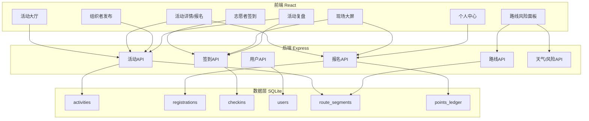
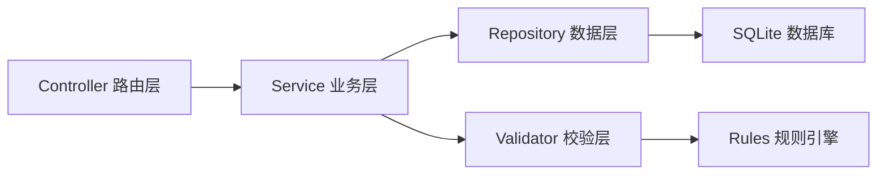
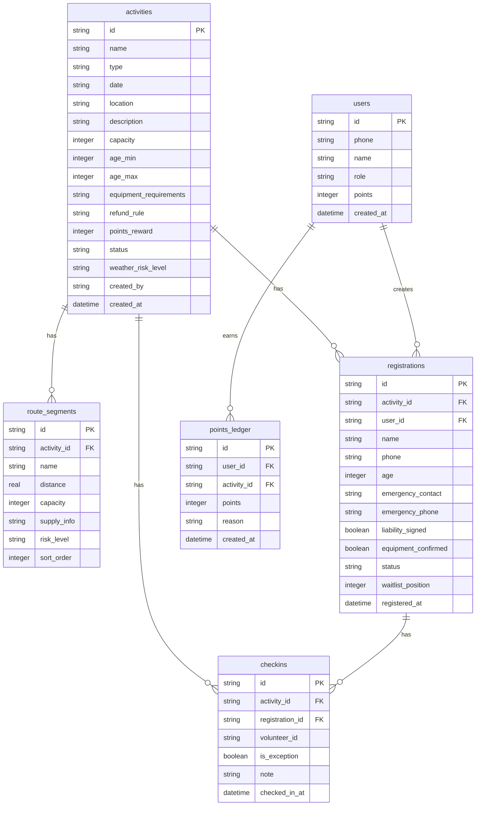

## 1. 架构设计



## 2. 技术说明

- 前端：React@18 + TypeScript + TailwindCSS@3 + Vite
- 初始化工具：vite-init (react-express-ts 模板)
- 后端：Express@4 + TypeScript (ESM)
- 数据库：SQLite (better-sqlite3)
- 状态管理：Zustand
- 图标：lucide-react

## 3. 路由定义

| 路由 | 用途 |
|------|------|
| / | 活动大厅首页 |
| /activity/:id | 活动详情/报名页 |
| /publish | 组织者发布活动页 |
| /checkin/:id | 志愿者签到页 |
| /risk/:id | 路线风险面板 |
| /dashboard/:id | 现场大屏 |
| /review/:id | 活动复盘 |
| /profile | 个人中心 |

## 4. API定义

### 4.1 活动相关

```typescript
// GET /api/activities - 获取活动列表
interface ActivityListQuery {
  type?: 'hike' | 'bike'
  status?: 'open' | 'full' | 'ongoing' | 'ended' | 'weather_cancelled'
  keyword?: string
}
interface ActivityListItem {
  id: string
  name: string
  type: 'hike' | 'bike'
  date: string
  location: string
  status: string
  currentCount: number
  capacity: number
  waitlistCount: number
  coverImage: string
}

// GET /api/activities/:id - 获取活动详情
interface ActivityDetail extends ActivityListItem {
  description: string
  routeSegments: RouteSegment[]
  equipmentRequirements: string[]
  ageMin: number
  ageMax: number
  refundRule: string
  pointsReward: number
  weatherRiskLevel: 'low' | 'medium' | 'high'
  weatherInfo: WeatherInfo
}

// POST /api/activities - 创建活动
interface CreateActivityBody {
  name: string
  type: 'hike' | 'bike'
  date: string
  location: string
  description: string
  capacity: number
  ageMin: number
  ageMax: number
  equipmentRequirements: string[]
  routeSegments: Omit<RouteSegment, 'id' | 'activityId'>[]
  refundRule: string
  pointsReward: number
}

// PUT /api/activities/:id/status - 更新活动状态（天气取消等）
interface UpdateActivityStatusBody {
  status: 'weather_cancelled' | 'ongoing' | 'ended'
  reason?: string
}
```

### 4.2 报名相关

```typescript
// POST /api/activities/:id/register - 报名
interface RegisterBody {
  name: string
  phone: string
  age: number
  emergencyContact: string
  emergencyPhone: string
  liabilitySigned: boolean
  equipmentConfirmed: boolean
}
interface RegisterResult {
  success: boolean
  status: 'confirmed' | 'waitlisted'
  position?: number // 候补位置
  message: string
}

// DELETE /api/registrations/:regId - 取消报名
interface CancelResult {
  success: boolean
  message: string
  promotedRegistration?: { id: string; name: string } // 被转正的候补者
}

// GET /api/activities/:id/registrations - 获取报名列表
interface RegistrationItem {
  id: string
  name: string
  phone: string
  age: number
  status: 'confirmed' | 'waitlisted' | 'cancelled' | 'refunded'
  waitlistPosition: number | null
  liabilitySigned: boolean
  equipmentConfirmed: boolean
  registeredAt: string
}

// GET /api/users/:phone/registrations - 获取个人报名记录
interface MyRegistration extends RegistrationItem {
  activityName: string
  activityDate: string
  activityStatus: string
}
```

### 4.3 签到相关

```typescript
// POST /api/activities/:id/checkin - 签到
interface CheckinBody {
  registrationId: string
  volunteerId: string
  note?: string
  isException?: boolean
}

// GET /api/activities/:id/checkin/stats - 签到统计
interface CheckinStats {
  total: number
  checkedIn: number
  notCheckedIn: number
  exceptions: number
  checkinRate: number
}
```

### 4.4 用户相关

```typescript
// POST /api/users/login - 登录
interface LoginBody {
  phone: string
  role: 'citizen' | 'organizer' | 'volunteer'
}

// GET /api/users/:id/points - 积分明细
interface PointsLedger {
  total: number
  records: { activityId: string; activityName: string; points: number; createdAt: string }[]
}
```

### 4.5 路线风险

```typescript
// GET /api/activities/:id/route-risk - 路线风险数据
interface RouteRiskData {
  segments: (RouteSegment & {
    currentLoad: number
    capacity: number
    riskLevel: 'low' | 'medium' | 'high'
  })[]
  weather: WeatherInfo
}
interface WeatherInfo {
  temperature: number
  condition: 'sunny' | 'cloudy' | 'rainy' | 'stormy'
  windSpeed: number
  alertLevel: 'none' | 'yellow' | 'orange' | 'red'
}

// POST /api/activities/:id/weather-cancel - 天气取消
interface WeatherCancelResult {
  success: boolean
  refundedCount: number
  notifiedCount: number
}
```

### 4.6 复盘数据

```typescript
// GET /api/activities/:id/review - 复盘数据
interface ReviewData {
  activity: ActivityDetail
  stats: {
    totalRegistrations: number
    confirmedCount: number
    waitlistCount: number
    cancelledCount: number
    checkinRate: number
    exceptionCount: number
    totalPointsIssued: number
    refundCount: number
  }
  exceptions: { registrationId: string; name: string; note: string; createdAt: string }[]
  timeline: { time: string; event: string; detail: string }[]
}
```

## 5. 服务端架构图



## 6. 数据模型

### 6.1 数据模型定义



### 6.2 数据定义语言

```sql
CREATE TABLE users (
  id TEXT PRIMARY KEY,
  phone TEXT NOT NULL UNIQUE,
  name TEXT NOT NULL,
  role TEXT NOT NULL CHECK(role IN ('citizen', 'organizer', 'volunteer')),
  points INTEGER NOT NULL DEFAULT 0,
  created_at TEXT NOT NULL DEFAULT (datetime('now'))
);

CREATE TABLE activities (
  id TEXT PRIMARY KEY,
  name TEXT NOT NULL,
  type TEXT NOT NULL CHECK(type IN ('hike', 'bike')),
  date TEXT NOT NULL,
  location TEXT NOT NULL,
  description TEXT NOT NULL DEFAULT '',
  capacity INTEGER NOT NULL,
  age_min INTEGER NOT NULL DEFAULT 0,
  age_max INTEGER NOT NULL DEFAULT 100,
  equipment_requirements TEXT NOT NULL DEFAULT '[]',
  refund_rule TEXT NOT NULL DEFAULT '',
  points_reward INTEGER NOT NULL DEFAULT 0,
  status TEXT NOT NULL DEFAULT 'open' CHECK(status IN ('open', 'full', 'ongoing', 'ended', 'weather_cancelled')),
  weather_risk_level TEXT NOT NULL DEFAULT 'low' CHECK(weather_risk_level IN ('low', 'medium', 'high')),
  created_by TEXT NOT NULL REFERENCES users(id),
  created_at TEXT NOT NULL DEFAULT (datetime('now'))
);

CREATE TABLE route_segments (
  id TEXT PRIMARY KEY,
  activity_id TEXT NOT NULL REFERENCES activities(id) ON DELETE CASCADE,
  name TEXT NOT NULL,
  distance REAL NOT NULL DEFAULT 0,
  capacity INTEGER NOT NULL DEFAULT 0,
  supply_info TEXT NOT NULL DEFAULT '',
  risk_level TEXT NOT NULL DEFAULT 'low' CHECK(risk_level IN ('low', 'medium', 'high')),
  sort_order INTEGER NOT NULL DEFAULT 0
);

CREATE TABLE registrations (
  id TEXT PRIMARY KEY,
  activity_id TEXT NOT NULL REFERENCES activities(id),
  user_id TEXT NOT NULL REFERENCES users(id),
  name TEXT NOT NULL,
  phone TEXT NOT NULL,
  age INTEGER NOT NULL,
  emergency_contact TEXT NOT NULL DEFAULT '',
  emergency_phone TEXT NOT NULL DEFAULT '',
  liability_signed INTEGER NOT NULL DEFAULT 0,
  equipment_confirmed INTEGER NOT NULL DEFAULT 0,
  status TEXT NOT NULL DEFAULT 'confirmed' CHECK(status IN ('confirmed', 'waitlisted', 'cancelled', 'refunded')),
  waitlist_position INTEGER,
  registered_at TEXT NOT NULL DEFAULT (datetime('now'))
);

CREATE UNIQUE INDEX idx_reg_activity_phone ON registrations(activity_id, phone, status);
CREATE INDEX idx_reg_activity_status ON registrations(activity_id, status);
CREATE INDEX idx_reg_waitlist ON registrations(activity_id, waitlist_position) WHERE status = 'waitlisted';

CREATE TABLE checkins (
  id TEXT PRIMARY KEY,
  activity_id TEXT NOT NULL REFERENCES activities(id),
  registration_id TEXT NOT NULL REFERENCES registrations(id),
  volunteer_id TEXT NOT NULL REFERENCES users(id),
  is_exception INTEGER NOT NULL DEFAULT 0,
  note TEXT NOT NULL DEFAULT '',
  checked_in_at TEXT NOT NULL DEFAULT (datetime('now'))
);

CREATE INDEX idx_checkin_activity ON checkins(activity_id);

CREATE TABLE points_ledger (
  id TEXT PRIMARY KEY,
  user_id TEXT NOT NULL REFERENCES users(id),
  activity_id TEXT NOT NULL REFERENCES activities(id),
  points INTEGER NOT NULL,
  reason TEXT NOT NULL DEFAULT '',
  created_at TEXT NOT NULL DEFAULT (datetime('now'))
);

CREATE INDEX idx_points_user ON points_ledger(user_id);
```
